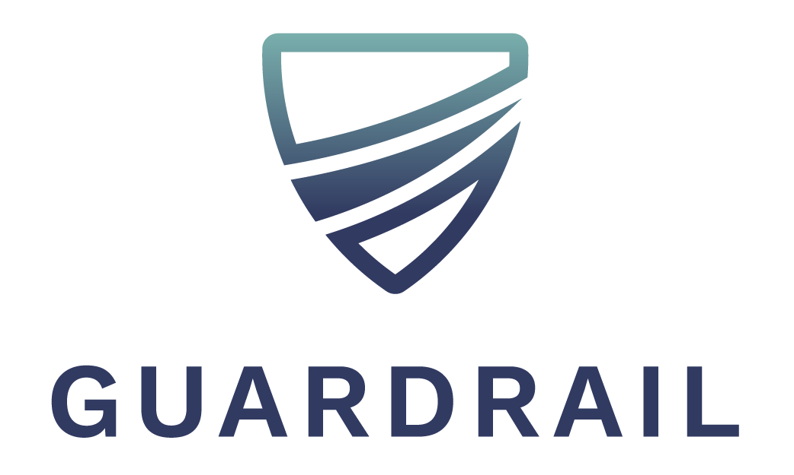

# [Guardrail Service Testing](https://guardrail-service-testing.github.io/)

  

<h2>Guardrail: Service Testing</h2>

[Guardrail](https://guardrail-service-testing.github.io) is an open-source “traffic replay” tool created to help reduce incidents in production by using recorded HTTP traffic to generate regression tests for stateless microservices. The tests run as out-of-process component tests using traffic replay and service virtualization.
